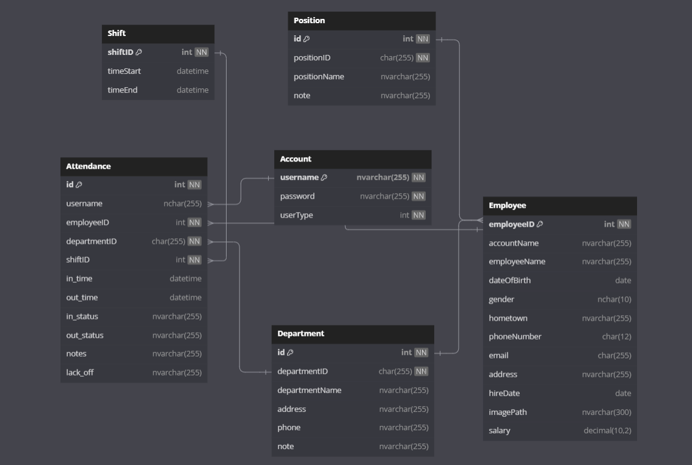
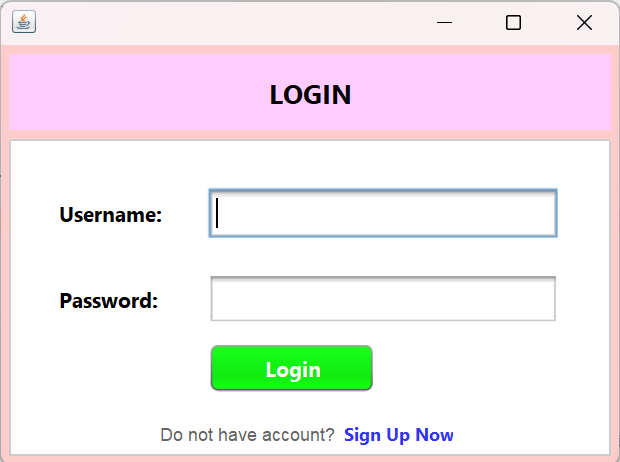
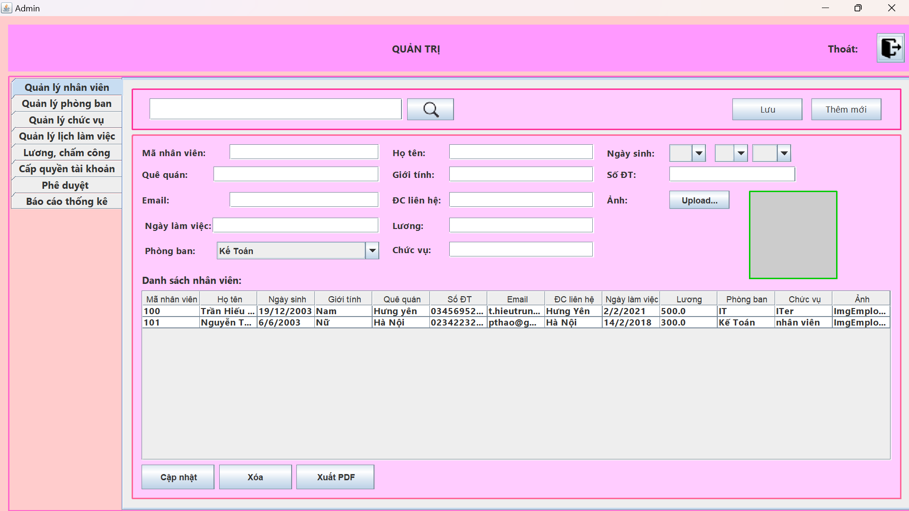
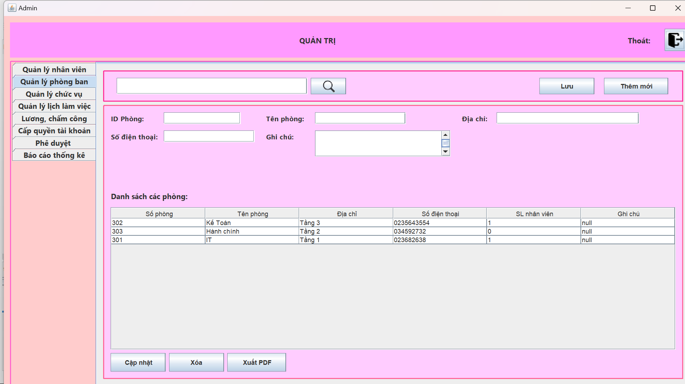
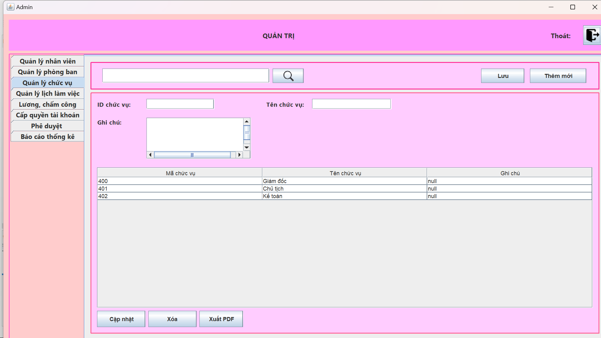
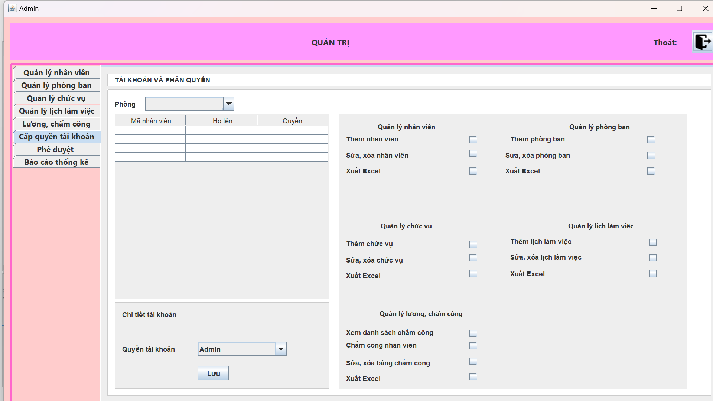
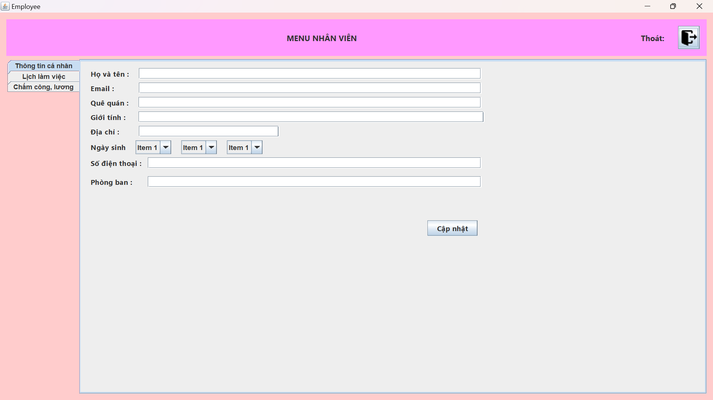
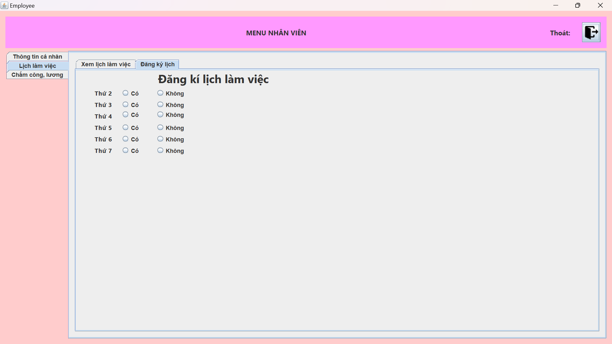

Xây dựng phầm mềm quản lý nhân sự bằng Java
 
----------------- Group 4 -----------------
 
- Các công nghệ sử dụng:
+ Sử dụng JavaSwing để thiết kế các giao diện của hệ thống
+ Làm việc và thao tác với file để đọc và ghi dữ liệu (vì thầy giáo không yêu cầu sử dụng đến SQL nên nhóm không kết nối JDBC)

- Libraries package:
+ JDK 19
+ jcalendar-1.4.jar

- Các chức năng chính:
+ Đăng nhập (theo tài khoản admin hoặc nhân viên)
+ Đăng ký (tài khoản admin hoặc nhân viên)
+ Các chức năng giao diện của trang nhân viên (khi đăng nhập bằng tài khoản nhân viên)
+ Các chức năng giao diện của trang quản trị (khi đăng nhập bằng tk admin)

- Database:

- Các giao diện của phần mềm:
+ Giao diện đăng nhập

+ Giao diện đăng ký

+Giao diện phía quản trị

+Giao diện phía nhân viên

Download IDE Netbeans: <a href="https://netbeans.apache.org/front/main/download/index.html">https://netbeans.apache.org/front/main/download/index.html</a> 
Download JDK Oracle package: <a href="https://www.oracle.com/java/technologies/downloads/">https://www.oracle.com/java/technologies/downloads/</a> 
Tài liệu tham khảo: 
<a href="https://www.javatpoint.com/exception-handling-in-java">Exception Handling in Java</a> 
<a href="https://www.javatpoint.com/java-io">Java I/O Tutorial</a> 
<a href="https://www.javatpoint.com/java-swing">Java Swing Tutorial</a> 
hoặc
<a href="https://www.javatpoint.com/java-awt">Java AWT Tutorial</a> 
<a href="https://www.javatpoint.com/serialization-in-java">Serialization and Deserialization in Java</a>